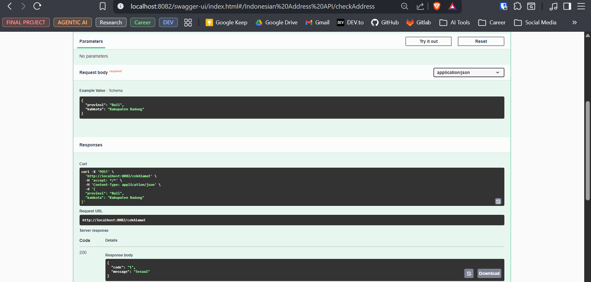
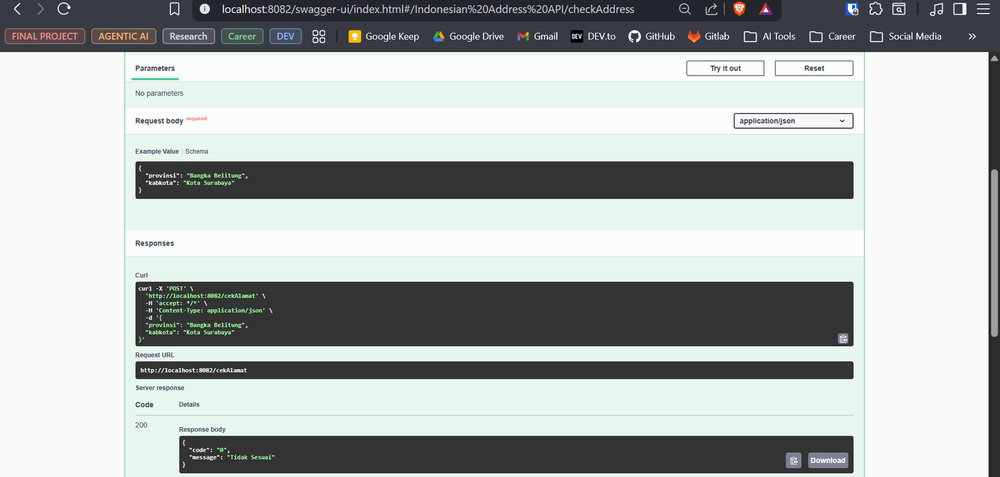

# MII Test – Technical Solutions

This repository contains solutions for two technical test questions:

- Indonesian Address Validation REST API (Spring Boot)
- Square Display Algorithm (Console-based algorithm)

Each solution is isolated in its own directory.

## 📦 Project Structure

```
.
├── miitest-1/   # Indonesian Address Validation REST API
└── miitest-2/   # Square Display Algorithm
```

---

## 🚀 miitest-1 — Indonesian Address Validation REST API

A Spring Boot REST API to validate whether a given kabupaten/kota belongs to a specified province, using an external Indonesian address API.

### ✨ Features

- RESTful endpoint for address validation
- External API integration
- Swagger UI for API testing
- Docker support
- Environment-based configuration

### ⚙️ Prerequisites

- Java 17+
- Maven
- Docker (optional)

### 🔧 Configuration

Copy the environment template:

```bash
cp env.example .env
```

Set the external API URL:

```
INDONESIAN_ADDRESS_API_URL=https://alamat.thecloudalert.com/api
```

### ▶️ Run Locally (Maven)

```bash
cd miitest-1

mvn clean install

mvn spring-boot:run
```

Application will run at:

- **API**: http://localhost:8080
- **Swagger UI**: http://localhost:8080/swagger-ui.html

### 🐳 Run with Docker

```bash
cd miitest-1

docker build -t indonesian-address-api .

docker run -p 8080:8080 \
  -e INDONESIAN_ADDRESS_API_URL=https://alamat.thecloudalert.com/api \
  indonesian-address-api
```

### 📌 API Endpoint

**POST** `/cekAlamat`

Validate whether a city/regency belongs to a given province.

#### Request Body

```json
{
  "provinsi": "province_id",
  "kabkota": "city_name"
}
```

#### Valid Response

Returned when `kabkota` exists within the specified `provinsi`



#### Invalid Response

Returned when `kabkota` does not belong to the specified `provinsi`



---

## 🧮 miitest-2 — Square Drawing Algorithm

A simple algorithm to generate and display an N × N square pattern, followed by a combined row output.

### 📥 Input

- Integer N
- Constraint: 3 ≤ N ≤ 9

### 📤 Output

- Standard N×N square pattern
- Combined horizontal square output

### 🧾 Example

**Input**: `3`

**Output**:

```
===
| |
===
===| |===
```

### 🧠 Algorithm Steps

1. Validate input range (3 ≤ N ≤ 9)
2. Generate an N×N square pattern
3. Combine all rows into a single output line
4. Display final result

Pseudocode and detailed logic can be found in: [miitest-2/test2.txt](miitest-2/test2.txt)
